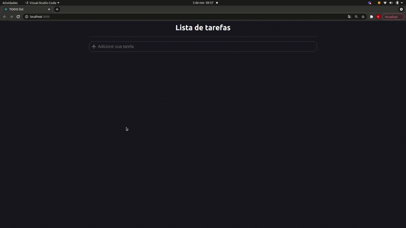

<h2 align="center">Todo list com react</h2>

🚩 Sitema de listagem de tarefas do seu dia a dia 

<h2 align="center">Status do Projeto</h2>
<h4  id="status" align="center"> 
  Status do projeto 🚀 Finalizado 
</h4>

<h2 align="center"> Features </h2>

- [x] Adicionar tarefas
- [x] Finalizar a tarefa

<h2 align="center" > Screenshot da aplicação </h2>

<h2 align="center" id="tecnologias"> 🛠 Tecnologias </h2>

:heavy_check_mark: React  

<h2 align="center" id="autor"> Autora </h2>

Feito com ❤️ por Keylane Silva 👋🏽 Entre em contato! 

